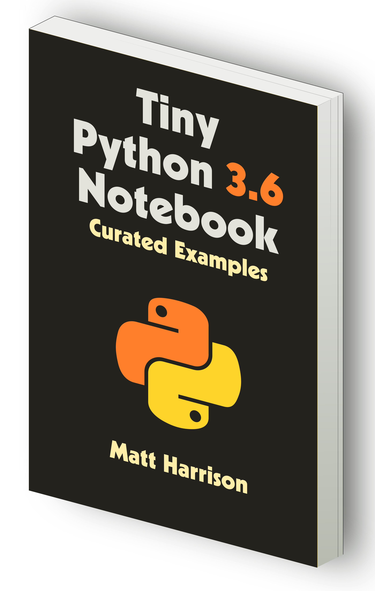
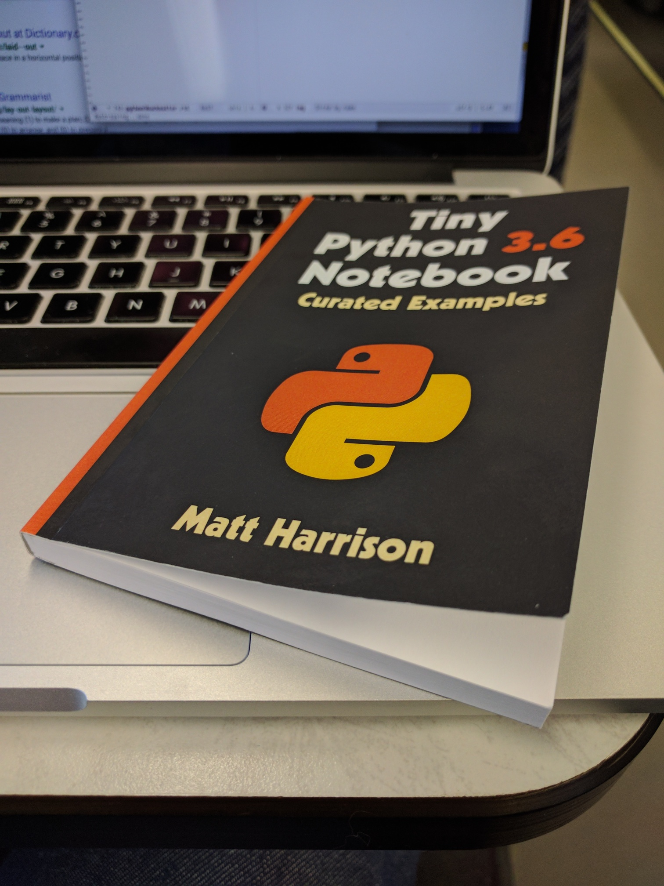

Tiny Python 3.6 Notebook
========================

This repository contains the text for the *Tiny Python 3.6 Notebook*.

Warning, this is not an introduction to Python. Rather it is a notebook
containing curated examples for Python 3 as well as the new features
found in Python 3.6. It is designed to accompany technical corporate
training offered by the author or aid those who want a quick refresher
to the Python syntax.

Reviews
---------

> This is an awesome python3 resource I share all the time. 🐍🎉 - @nnja (MS Developer Advocate)

> I think it's pretty awesome. It's all of the syntax boiled down to just the facts man. - Brian Okken (Host of Test & Code podcast)

> It's the perfect follow on to a training course. - Michael Kennedy (Host of Talk Python podcast)

> Great Python reference book by @\_\_mharrison\_\_ "Tiny Python 3.6 Notebook" It's NOT a @ProjectJupyter notebook - @okeedoak

> Goodness! So thankful for @\_\_mharrison\_\_ and his Tiny Python 3.6 Notebook. Great resource! Go get it…  - @\_\_jamesssio\_\_

> Tiny #Python notebook for looking up all the basics. I found this a very concise read if you have some prev prog exp - @andreasose

> Useful collection of notes on Python 3.6 - @hjelmj

> Cool work: a tiny and handy notebook containing notes, tables and examples for Python 3.6. Very much recommended! - @epaillas

> I keep a copy on my desk.  Excellent resource - @HLIBIndustry

> Awesome community work! - @MostafaElzoghbi

> Интересный формат книги по #python - @ku_al

Bulk Purchase
---------------

If you are interested in purchasing larger amounts (100+) for schools, employees or for
use as giveaways/swag at a conference (much better than a tshirt!), get in touch 
with Matt (matt at metasnake dot com).

Thanks
------

If you enjoy this content, consider [purchasing the physical version](https://www.amazon.com/dp/1542883253/ref=as_li_ss_il?ie=UTF8&qid=1487086306&sr=8-7&keywords=python+3.6&linkCode=li2&tag=hairysuncom-20&linkId=5bed517e28e53633e149006968a55f67).
It is a hand laid out version that fits in the pocket and has blank
pages in the back for note taking. It is available at [Amazon](https://www.amazon.com/dp/1542883253/ref=as_li_ss_il?ie=UTF8&qid=1487086306&sr=8-7&keywords=python+3.6&linkCode=li2&tag=hairysuncom-20&linkId=5bed517e28e53633e149006968a55f67). I'm
indebted to those who support my work and write reviews. Thanks!

Feel free to share this repository on social media.

Errors
------

The author is human and will certainly make errors. You may file a bug
and it may be resolved in a future version of the book. I love feedback
and would love to hear your ideas on what is missing or could be
improved.

Contents
--------

This book covers the syntax in Python up to version 3.6.

License
-------

This content is licensed under the
Attribution-NonCommercial-NoDerivatives 4.0 International (CC BY-NC-ND
4.0)

<https://creativecommons.org/licenses/by-nc-nd/4.0/>
