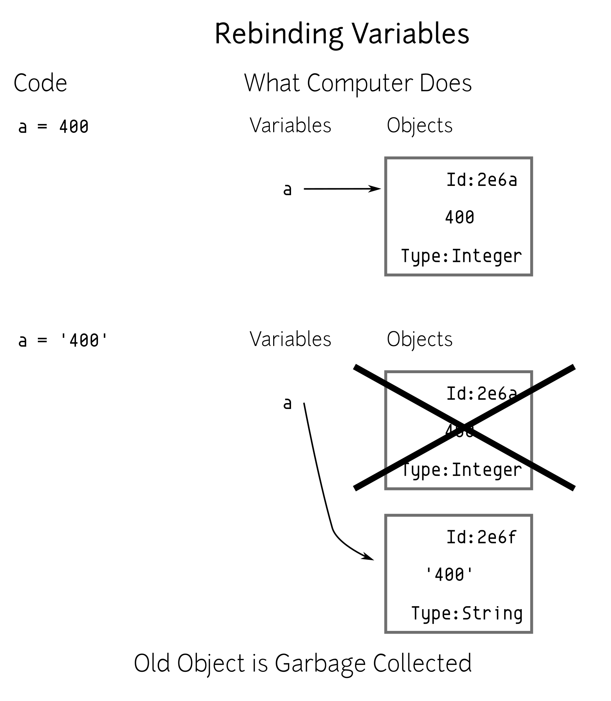
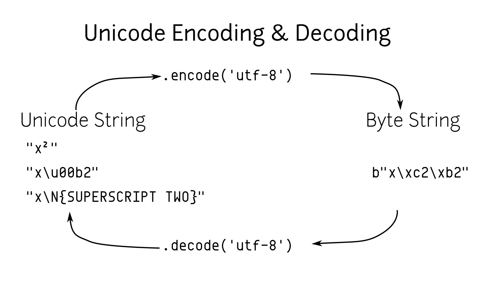

Introduction
==============

This is not so much an instructional manual, but rather notes, tables, and
examples for Python syntax. It was created by the author as an additional
resource during training, meant to be distributed as a physical notebook.
Participants (who favor the physical characteristics of dead tree material)
could add their own notes, thoughts, and have a valuable reference
of curated examples.

Running Python
==============

Installation
---------------

To check if Python is installed, run the following from a terminal::

  $ python3 --version

Otherwise, install Python 3 from the website [#]_.

.. [#] http://python.org

Invoking Python
---------------

The Python executable will behave differently depending on the command line options you give it:

* Start the Python REPL::

   $ python3

* Execute the ``file.py`` file::

    $ python3 file.py

* Execute the ``file.py`` file, and drop into REPL with namespace of ``file.py``::

   $ python3 -i file.py

* Execute the ``json/tool.py`` module::

   $ python3 -m json.tool

* Execute ``"print('hi')"`` ::

    $ python3 -c "print('hi')"

REPL
----

* Use the ``help`` function to read the documentation for a module/class/function. As a standalone invocation,
  you enter the help system and can explore various topics.
* Use the ``dir`` function to list contents of the namespace, or attributes of an object if you pass one in

.. note::

  The majority of code in this book is written as if it were executed in a REPL. If you
  are typing it in, ignore the primary and secondary prompts (``>>>`` and ``...``).

The Zen of Python
===================

Run the following in an interpreter to get an Easter egg that describes some of the ethos behind Python. This is also codified in PEP 20::

    >>> import this
    The Zen of Python, by Tim Peters

    Beautiful is better than ugly.
    Explicit is better than implicit.
    Simple is better than complex.
    Complex is better than complicated.
    Flat is better than nested.
    Sparse is better than dense.
    Readability counts.
    Special cases aren't special enough to break the
    rules.
    Although practicality beats purity.
    Errors should never pass silently.
    Unless explicitly silenced.
    In the face of ambiguity, refuse the temptation
    to guess.
    There should be one --and preferably only one--
    obvious way to do it.
    Although that way may not be obvious at first
    unless you're Dutch.
    Now is better than never.
    Although never is often better than *right* now.
    If the implementation is hard to explain, it's a
    bad idea.
    If the implementation is easy to explain, it may
    be a good idea.
    Namespaces are one honking great idea -- let's
    do more of those!

These might just seem like silly one liners, but there is a lot of wisdom
packed in here. It is good for Python programmers to review these
every once in a while and see if these hold true for their code. (Or to
justify their code reviews)

Built-in Types
===============

Variables
---------

Python variables are like cattle tags, they point to objects (which can be
classes, instances, modules, or functions), but variables are not the objects. You can
reuse variable names for different object types (though you probably shouldn't)::

   >>> a = 400     # a points to an integer
   >>> a = '400'   # a now points to a string

.. note::

   The ``#`` character denotes the start of a comment. There are no multi-line comments, though
   most editors with Python support can comment out a region.

The figure that follows illustrates how everything is an object in Python and variables just point to them.

   Illustration of reusing the same variable 

.. raw:: latex

   %\Needspace{5\baselineskip}
   \clearpage

Numbers
-----------

Python includes three types of numeric literals:
*integers*, *floats*, and *complex numbers*.
Python 3.6 adds the ability to use underscores to
improve readability (PEP 515).

.. raw:: latex

   \Needspace{5\baselineskip}

..  longtable: format: {r l}

.. table:: Number types

  
  ================ ===========================
  Type             Example
  ================ ===========================
  Integer          ``14``
  Integer (Hex)    ``0xe``
  Integer (Octal)  ``0o16``
  Integer (Binary) ``0b1110``
  Float            ``14.0``
  Float            ``1.4e1``
  Complex          ``14+0j``
  Underscore       ``1_000``
  ================ ===========================

There are many built-in functions for manipulating
numbers ie. ``abs``, ``min``, ``max``, ``ceil``.
Also see the ``math``, ``random``, and ``statistics`` modules in
the standard library.

..  longtable: format: {p{.3\textwidth} l >{\raggedright\arraybackslash}p{.3\textwidth}}

..  longtable: format: {>{\hangindent=1em\hangafter=1 }p{.3\textwidth} l >{\hangindent=1em\hangafter=1 }p{.3\textwidth}}

.. table:: Number magic methods
  
  ====================== ================== =====================================
  Operation              Provided By        Result
  ====================== ================== =====================================
  ``abs(num)``           ``__abs__``        Absolute value of ``num``
  ``num + num2``         ``__add__``        Addition
  ``bool(num)``          ``__bool__``       Boolean conversion
  ``num == num2``        ``__eq__``         Equality
  ``float(num)``         ``__float__``      Float conversion
  ``num // num2``        ``__floordiv__``   Integer division
  ``num >= num2``        ``__ge__``         Greater or equal
  ``num > num2``         ``__gt__``         Greater than
  ``int(num)``           ``__int__``        Integer conversion
  ``num <= num2``        ``__le__``         Less or equal
  ``num < num2``         ``__lt__``         Less than
  ``num % num2``         ``__mod__``        Modulus
  ``num * num2``         ``__mul__``        Multiplication
  ``num != num2``        ``__ne__``         Not equal
  ``-num``               ``__neg__``        Negative
  ``+num``               ``__pos__``        Positive
  ``num ** num2``        ``__pow__``        Power
  ``round(num)``         ``__round__``      Round
  ``num.__sizeof__()``   ``__sizeof__``     Bytes for internal representation
  ``str(num)``           ``__str__``        String conversion
  ``num - num2``         ``__sub__``        Subtraction
  ``num / num2``         ``__truediv__``    Float division
  ``math.trunc(num)``    ``__trunc__``      Truncation
  ====================== ================== =====================================

..  longtable: format: {p{.3\textwidth} l >{\raggedright\arraybackslash}p{.3\textwidth}}

.. table:: Integer specific methods and operations 
  
  ==================== ================== =====================================
  Operation            Provided By        Result
  ==================== ================== =====================================
  ``num & num2``       ``__and__``        Bitwise and
  ``math.ceil(num)``   ``__ceil__``       Ceiling
  ``math.floor(num)``  ``__floor__``      Floor
  ``~num``             ``__invert__``     Bitwise inverse
  ``num << num2``      ``__lshift__``     Left shift
  ``num | num2``       ``__or__``         Bitwise or
  ``num >> num2``      ``__rshift__``     Right shift
  ``num ^ num2``       ``__xor__``        Bitwise xor
  ``num.bit_length()`` ``bit_length``     Number of bits necessary
  ==================== ================== =====================================

..  longtable: format: {p{.4\textwidth} p{.5\textwidth}}

.. table:: Float specific methods and operations
  
  ================================== ========================
  Operation                          Result
  ================================== ========================
  ``f.as_integer_ratio()``           Returns num, denom tuple
  ``f.is_integer()``                 Boolean if whole number
  ================================== ======================== 

Strings
-----------

Python 3 strings hold unicode data. Python has a few ways to represent strings. There is also a bytes type (PEP 3137):

.. raw:: latex

   \Needspace{10\baselineskip}

..  longtable: format: {r l}

.. table:: String types
  
  ================ ===========================
  Type             Example
  ================ ===========================
  String           ``"hello\tthere"``
  String           ``'hello'``
  String           ``'''He said, "hello"'''``
  Raw string       ``r'hello\tthere'``
  Byte string      ``b'hello'``
  ================ ===========================

.. table:: Escape Characters

  =================== =================
  Escape Sequence     Output
  =================== =================
  ``\`` newline       Ignore trailing newline in triple quoted string
  ``\\``              Backslash
  ``\'``              Single quote
  ``\"``              Double quote
  ``\a``              ASCII Bell
  ``\b``              ASCII Backspace
  ``\n``              Newline
  ``\r``              ASCII carriage return
  ``\t``              Tab
  ``\u12af``          Unicode 16 bit
  ``\U12af89bc``      Unicode 32 bit
  ``N{BLACK STAR}``   Unicode name
  ``\o84``            Octal character
  ``\xFF``            Hex character
  =================== =================
  

..  longtable: format: {p{.3\textwidth} l >{\raggedright\arraybackslash}p{.3\textwidth}}

..  longtable: format: {>{\hangindent=1em\hangafter=1\raggedright\arraybackslash }p{.3\textwidth} l >{\hangindent=1em\hangafter=1\raggedright\arraybackslash }p{.3\textwidth}}

.. table:: String operations
  
  ============================= ========================= ==========================================================
  Operation                     Provided By               Result
  ============================= ========================= ==========================================================
  ``s + s2``                    ``__add__``               String concatenation
  ``"foo" in s``                ``__contains__``          Membership
  ``s == s2``                   ``__eq__``                Equality
  ``s >= s2``                   ``__ge__``                Greater or equal
  ``s[0]``                      ``__getitem__``           Index operation
  ``s > s2``                    ``__gt__``                Greater
  ``s <= s2``                   ``__le__``                Less than or equal
  ``len(s)``                    ``__len__``               Length
  ``s < s2``                    ``__lt__``                Less than
  ``s % (1, 'foo')``            ``__mod__``               Formatting
  ``s * 3``                     ``__mul__``               Repetition
  ``s != s2``                   ``__ne__``                Not equal
  ``repr(s)``                   ``__repr__``              Programmer friendly string
  ``s.__sizeof__()``            ``__sizeof__``            Bytes for internal representation
  ``str(s)``                    ``__str__``               User friendly string
  ============================= ========================= ==========================================================

..  longtable: format: {>{\hangindent=1em\hangafter=1 }p{.35\textwidth} p{.55\textwidth}} 

.. prevent header at bottom of page

.. raw:: latex

   \Needspace{5\baselineskip}

..  longtable: format: {>{\hangindent=1em\hangafter=1\raggedright\arraybackslash }p{.3\textwidth} >{\hangindent=1em\hangafter=1\raggedright\arraybackslash }p{.6\textwidth}}

.. table:: String methods

  ======================================================= ===========================================================
  Operation                                               Result
  ======================================================= ===========================================================
  ``s.capitalize()``                                      Capitalizes a string
  ``s.casefold()``                                        Lowercase in a unicode compliant manner
  ``s.center(w, [char])``                                 Center a string in ``w`` spaces with ``char`` (default ``" "``)
  ``s.count(sub, [start, [end]])``                        Count ``sub`` in ``s`` between ``start`` and ``end``
  ``s.encode(encoding, errors= 'strict')``                Encode a string into bytes
  ``s.endswith(sub)``                                     Check for a suffix
  ``s.expandtabs( tabsize=8)``                            Replaces tabs with spaces
  ``s.find(sub, [start, [end]])``                         Find substring or return ``-1``
  ``s.format(*args, **kw)``                               Format string
  ``s.format_map( mapping)``                              Format strings with a mapping
  ``s.index(sub, [start, [end]])``                        Find substring or raise ``ValueError``
  ``s.isalnum()``                                         Boolean if alphanumeric
  ``s.isalpha()``                                         Boolean if alphabetic
  ``s.isdecimal()``                                       Boolean if decimal
  ``s.isdigit()``                                         Boolean if digit
  ``s.isidentifier()``                                    Boolean if valid identifier
  ``s.islower()``                                         Boolean if lowercase
  ``s.isnumeric()``                                       Boolean if numeric
  ``s.isprintable()``                                     Boolean if printable
  ``s.isspace()``                                         Boolean if whitespace
  ``s.istitle()``                                         Boolean if titlecased
  ``s.isupper()``                                         Boolean if uppercased
  ``s.join(iterable)``                                    Return a string inserted between sequence
  ``s.ljust(w, [char])``                                  Left justify in ``w`` spaces with ``char`` (default ``' '``)
  ``s.lower()``                                           Lowercase
  ``s.lstrip([chars])``                                   Left strip ``chars`` (default spacing).
  ``s.partition(sub)``                                    Split string at first occurrence of substring, return ``(before, sub, after)``
  ``s.replace(old, new, [count])``                        Replace substring with new string
  ``s.rfind(sub, [start, [end]])``                        Find rightmost substring or return ``-1``
  ``s.rindex(sub, [start, [end]])``                       Find rightmost substring or raise ``ValueError``
  ``s.rjust(w, [char)``                                   Right justify in w spaces with char (default ``" "``)
  ``s.rpartition(sub)``                                   Rightmost partition
  ``s.rsplit([sep, [maxsplit=-1])``                       Rightmost split by ``sep`` (defaults to whitespace)
  ``s.rstrip([chars])``                                   Right strip
  ``s.split([sep, [maxsplit=-1]])``                       Split a string into sequence around substring
  ``s.splitlines( keepends=False)``                       Break string at line boundaries
  ``s.startswith( prefix, [start, [end]])``               Check for prefix
  ``s.strip([chars])``                                    Remove leading and trailing whitespace (default) or ``chars``
  ``s.swapcase()``                                        Swap casing of string
  ``s.title()``                                           Titlecase string
  ``s.translate(table)``                                  Use a translation table to replace strings
  ``s.upper()``                                           Uppercase
  ``s.zfill(width)``                                      Left fill with ``0`` so string fills ``width`` (no truncation)
  ======================================================= ===========================================================

Lists
-----

Lists are ordered mutable sequences::

  >>> people = ['Paul', 'John', 'George']
  >>> people.append('Ringo')

The ``in`` operator is useful for checking membership on sequences::

  >>> 'Yoko' in people
  False

If we need the index number during iteration, the ``enumerate`` function gives us a tuple of index, item pairs::

  >>> for i, name in enumerate(people, 1):
  ...     print('{} - {}'.format(i, name))
  1 - Paul
  2 - John
  3 - George
  4 - Ringo

We can do index operations on most sequences::

  >>> people[0]
  'Paul'
  >>> people[-1]  # len(people) - 1
  'Ringo'

We can also do *slicing* operations on most sequences::

  >>> people[1:2]
  ['John']
  >>> people[:1]   # Implicit start at 0
  ['Paul']
  >>> people[1:]   # Implicit end at len(people)
  ['John', 'George', 'Ringo']
  >>> people[::2]  # Take every other item
  ['Paul', 'George']
  >>> people[::-1] # Reverse sequence
  ['Ringo', 'George', 'John', 'Paul']

 
.. raw:: latex

   \Needspace{5\baselineskip}

..  longtable: format: {p{.25\textwidth} l >{\raggedright\arraybackslash}p{.35\textwidth}}

..  longtable: format: {>{\hangindent=1em\hangafter=1 }p{.25\textwidth} l >{\hangindent=1em\hangafter=1 }p{.35\textwidth}}

.. table:: List Operations
  
  ================================== ========================= ============================================================
  Operation                          Provided By               Result
  ================================== ========================= ============================================================
  ``l + l2``                         ``__add__``               List concatenation (see ``.extend``)
  ``"name" in l``                    ``__contains__``          Membership
  ``del l[idx]``                     ``__del__``               Remove item at index ``idx`` (see ``.pop``)
  ``l == l2``                        ``__eq__``                Equality
  ``"{}".format(l)``                 ``__format__``            String format of list
  ``l >= l2``                        ``__ge__``                Greater or equal. Compares items in lists from left
  ``l[idx]``                         ``__getitem__``           Index operation
  ``l > l2``                         ``__gt__``                Greater. Compares items in lists from left
  No hash                            ``__hash__``              Set to ``None`` to ensure you can't insert in dictionary
  ``l += l2``                        ``__iadd__``              Augmented (mutates ``l``) concatenation
  ``l *= 3``                         ``__imul__``              Augmented (mutates ``l``) repetition
  ``for thing in l:``                ``__iter__``              Iteration
  ``l <= l2``                        ``__le__``                Less than or equal. Compares items in lists from left
  ``len(l)``                         ``__len__``               Length
  ``l < l2``                         ``__lt__``                Less than. Compares items in lists from left
  ``l * 2``                          ``__mul__``               Repetition
  ``l != l2``                        ``__ne__``                Not equal
  ``repr(l)``                        ``__repr__``              Programmer friendly string
  ``reversed(l)``                    ``__reversed__``          Reverse
  ``foo * l``                        ``__rmul__``              Called if ``foo`` doesn't implement ``__mul__``
  ``l[idx] = 'bar'``                 ``__setitem__``           Index operation to set value
  ``l.__sizeof__()``                 ``__sizeof__``            Bytes for internal representation
  ``str(l)``                         ``__str__``               User friendly string
  ================================== ========================= ============================================================

..  longtable: format: {p{.4\textwidth} p{.55\textwidth}}

..  longtable: format: {>{\hangindent=1em\hangafter=1 }p{.4\textwidth} >{\hangindent=1em\hangafter=1 }p{.55\textwidth}}

.. table:: List Methods
  
  ============================================================ ============================================================
  Operation                                                    Result
  ============================================================ ============================================================
  ``l.append(item)``                                           Append ``item`` to end
  ``l.clear()``                                                Empty list (mutates ``l``)
  ``l.copy()``                                                 Shallow copy
  ``l.count(thing)``                                           Number of occurrences of ``thing``
  ``l.extend(l2)``                                             List concatenation (mutates ``l``)
  ``l.index(thing)``                                           Index of ``thing`` else ``ValueError``
  ``l.insert(idx, bar)``                                       Insert ``bar`` at index ``idx``
  ``l.pop([idx])``                                             Remove last item or item at ``idx``
  ``l.remove(bar)``                                            Remove first instance of ``bar`` else ``ValueError``
  ``l.reverse()``                                              Reverse (mutates ``l``)
  ``l.sort([key=], reverse=False)``                            In-place sort, by optional ``key`` function (mutates ``l``)
  ============================================================ ============================================================

Dictionaries
--------------

Dictionaries are mutable mappings of keys to values. Keys
must be hashable, but values can be any object::

  >>> instruments = {'Paul': 'Bass',
  ...                'John': 'Guitar'}

  >>> instruments['George'] = 'Guitar'
  >>> 'Ringo' in instruments
  False

  >>> for name in instruments:
  ...     print('{} - {}'.format(name,
  ...           instruments[name]))
  Paul - Bass
  John - Guitar
  George - Guitar
  

..  longtable: format: {p{.25\textwidth} l >{\raggedright\arraybackslash}p{.35\textwidth}}

..  longtable: format: {>{\hangindent=1em\hangafter=1\raggedright\arraybackslash }p{.25\textwidth} l >{\hangindent=1em\hangafter=1\raggedright\arraybackslash }p{.35\textwidth}}

.. table:: Magic Dictionary Methods
  
  ======================================= ========================= ============================================================
  Operation                               Provided By               Result
  ======================================= ========================= ============================================================
  ``key in d``                            ``__contains__``          Membership
  ``del d[key]``                          ``__delitem__``           Delete key
  ``d == d2``                             ``__eq__``                Equality. Dicts are equal or not equal
  ``"{}".format(d)``                      ``__format__``            String format of dict
  ``d[key]``                              ``__getitem__``           Get value for ``key`` (see ``.get``)
  ``for key in d:``                       ``__iter__``              Iteration over keys
  ``len(d)``                              ``__len__``               Length
  ``d != d2``                             ``__ne__``                Not equal
  ``repr(d)``                             ``__repr__``              Programmer friendly string
  ``d[key] = value``                      ``__setitem__``           Set ``value`` for ``key``
  ``d.__sizeof__()``                      ``__sizeof__``            Bytes for internal representation
  ======================================= ========================= ============================================================

..  longtable: format: {p{.3\textwidth}  >{\raggedright\arraybackslash}p{.6\textwidth}}

..  longtable: format: {>{\hangindent=1em\hangafter=1 }p{.3\textwidth} >{\hangindent=1em\hangafter=1 }p{.6\textwidth}}

.. table:: Dictionary Methods
  

  ================================================================= ============================================================
  Operation                                                         Result
  ================================================================= ============================================================
  ``d.clear()``                                                     Remove all items (mutates ``d``)
  ``d.copy()``                                                      Shallow copy
  ``d.fromkeys(iter, value=None)``                                  Create dict from iterable with values set to value
  ``d.get(key, [default])``                                         Get value for ``key`` or return default (``None``)
  ``d.items()``                                                     View of (key, value) pairs
  ``d.keys()``                                                      View of keys
  ``d.pop(key, [default])``                                         Return value for key or default (``KeyError`` if not set)
  ``d.popitem()``                                                   Return arbitrary (key, value) tuple. ``KeyError`` if empty
  ``d.setdefault(k,   [default])``                                  Does ``d.get(k, default)``. If ``k`` missing, sets to default
  ``d.update(d2)``                                                  Mutate ``d`` with values of ``d2`` (dictionary or iterable of (key, value) pairs)
  ``d.values()``                                                    View of values
  ================================================================= ============================================================

Tuples
-------

Tuples are immutable sequences. Typically they are used to store
*record* type data::

  >>> member = ('Paul', 'Bass', 1942)
  >>> member2 = ('Ringo', 'Drums', 1940)

Note that parentheses aren't usually required::

  >>> row = 1, 'Fred'     # 2 item tuple
  >>> row2 = (2, 'Bob')   # 2 item tuple
  >>> row3 = ('Bill')     # String!
  >>> row4 = ('Bill',)    # 1 item tuple
  >>> row5 = 'Bill',      # 1 item tuple
  >>> row6 = ()           # Empty tuple

Named tuples can be used in place of normal tuples and allow context (or names)
to be added to positional members. The syntax for creating them is a little
different because we are dynamically creating a class first (hence the
capitalized variable)::

  >>> from collections import namedtuple
  >>> Member = namedtuple('Member',
  ...     'name, instrument, birth_year')
  >>> member3 = Member('George', 'Guitar', 1943)

We can access members by position or name (name allows us to be more explicit)::

  >>> member3[0]
  'George'

  >>> member3.name
  'George'

..  longtable: format: {p{.3\textwidth} l >{\raggedright\arraybackslash}p{.3\textwidth}}

..  longtable: format: {>{\hangindent=1em\hangafter=1\raggedright\arraybackslash }p{.3\textwidth} l >{\hangindent=1em\hangafter=1\raggedright\arraybackslash }p{.3\textwidth}}

.. table:: Tuple Methods
  
  ================================== ========================= ============================================================
  Operation                          Provided                  Result
  ================================== ========================= ============================================================
  ``t + t2``                         ``__add__``               Tuple concatenation 
  ``"name" in t``                    ``__contains__``          Membership
  ``t == t2``                        ``__eq__``                Equality
  ``"{}".format(t)``                 ``__format__``            String format of tuple
  ``t >= t2``                        ``__ge__``                Greater or equal. Compares items in tuple from left
  ``t[idx]``                         ``__getitem__``           Index operation
  ``t > t2``                         ``__gt__``                Greater. Compares items in tuple from left
  ``hash(t)``                        ``__hash__``              For set/dict insertion
  ``for thing in t:``                ``__iter__``              Iteration
  ``t <= t2``                        ``__le__``                Less than or equal. Compares items in tuple from left
  ``len(t)``                         ``__len__``               Length
  ``t < t2``                         ``__lt__``                Less than. Compares items in tuple from left
  ``t * 2``                          ``__mul__``               Repetition
  ``t != t2``                        ``__ne__``                Not equal
  ``repr(t)``                        ``__repr__``              Programmer friendly string
  ``foo * t``                        ``__rmul__``              Called if ``foo`` doesn't implement ``__mul__``
  ``t.__sizeof__()``                 ``__sizeof__``            Bytes for internal representation
  ``str(l)``                         ``__str__``               User friendly string
  ================================== ========================= ============================================================

..  longtable: format: {p{.3\textwidth} p{.6\textwidth}}

.. table:: Tuple Methods
  
  ============================================================ ============================================================
  Operation                                                    Result
  ============================================================ ============================================================
  ``t.count(item)``                                            Count of item
  ``t.index(thing)``                                           Index of ``thing`` else ``ValueError``
  ============================================================ ============================================================

Sets
-----

A set is a mutable unordered collection that cannot contain duplicates. Sets are used to
remove duplicates and test for membership::

  >>> digits = [0, 1, 1, 2, 3, 4, 5, 6,
  ...     7, 8, 9]
  >>> digit_set = set(digits)   # remove extra 1

  >>> 9 in digit_set
  True

Sets are useful because they provide *set operations*, such as union
(``|``), intersection (``&``), difference (``-``), and xor (``^``)::

  >>> odd = {1, 3, 5, 7, 9}
  >>> prime = set([2, 3, 5, 7])
  >>> even = digit_set - odd
  >>> even
  {0, 2, 4, 6, 8}

  >>> prime & even  # in intersection
  {2}

  >>> odd | even    # in both
  {0, 1, 2, 3, 4, 5, 6, 7, 8, 9}

  >>> even ^ prime  # not in both
  {0, 3, 4, 5, 6, 7, 8}

.. raw:: latex

   \Needspace{10\baselineskip}

.. note::

  There is no literal syntax for an empty set. You need to use::

    >>> empty = set()

..  longtable: format: {p{.25\textwidth} l >{\raggedright\arraybackslash}p{.35\textwidth}}

..  longtable: format: {>{\hangindent=1em\hangafter=1\raggedright\arraybackslash }p{.25\textwidth} l >{\hangindent=1em\hangafter=1\raggedright\arraybackslash }p{.35\textwidth}}

.. table:: Set Methods
  
  ======================================= ========================= ============================================================
  Operation                               Provided By               Result
  ======================================= ========================= ============================================================
  ``s & s2``                              ``__and__``               Set intersection (see ``.intersection``)
  ``"name" in s``                         ``__contains__``          Membership
  ``s == s2``                             ``__eq__``                Equality. Sets are equal or not equal
  ``"{}".format(s)``                      ``__format__``            String format of set
  ``s >= s2``                             ``__ge__``                ``s`` in ``s2`` (see ``.issuperset``)
  ``s > s2``                              ``__gt__``                Strict superset (``s >= s2`` but ``s != s2``).
  No hash                                 ``__hash__``              Set to ``None`` to ensure you can't insert in dictionary
  ``s &= s2``                             ``__iand__``              Augmented (mutates ``s``) intersection (see ``.intersection_update``)
  ``s |= s2``                             ``__ior__``               Augmented (mutates ``s``) union (see ``.update``)
  ``s -= s2``                             ``__isub__``              Augmented (mutates ``s``) difference (see ``.difference_update``)
  ``for thing in s:``                     ``__iter__``              Iteration
  ``s ^= s2``                             ``__ixor__``              Augmented (mutates ``s``) xor (see ``.symmetric_difference_update``)
  ``s <= s2``                             ``__le__``                ``s2`` in ``s`` (see ``.issubset``)
  ``len(s)``                              ``__len__``               Length 
  ``s < s2``                              ``__lt__``                Strict subset (``s <= s2`` but ``s != s2``).
  ``s != s2``                             ``__ne__``                Not equal
  ``s | s2``                              ``__or__``                Set union (see ``.union``)
  ``foo & s``                             ``__rand__``              Called if ``foo`` doesn't implement ``__and__``
  ``repr(s)``                             ``__repr__``              Programmer friendly string
  ``foo | s``                             ``__ror__``               Called if ``foo`` doesn't implement ``__or__``
  ``foo - s``                             ``__rsub__``              Called if ``foo`` doesn't implement ``__sub__``
  ``foo ^ s``                             ``__rxor__``              Called if ``foo`` doesn't implement ``__xor__``
  ``s.__sizeof__()``                      ``__sizeof__``            Bytes for internal representation
  ``str(s)``                              ``__str__``               User friendly string
  ``s - s2``                              ``__sub__``               Set difference (see ``.difference``)
  ``s ^ s2``                              ``__xor__``               Set xor (see ``.symmetric_difference``)
  ======================================= ========================= ============================================================

.. raw:: latex

   %\Needspace{5\baselineskip}
   \clearpage

..  longtable: format: {p{.55\textwidth} p{.35\textwidth}}

..  longtable: format: {>{\hangindent=1em\hangafter=1\arraybackslash }p{.6\textwidth}  >{\hangindent=1em\hangafter=1\raggedright\arraybackslash }p{.30\textwidth}}

.. table:: Set Methods
  
  ================================================================= ============================================================
  Operation                                                         Result
  ================================================================= ============================================================
  ``s.add(item)``                                                   Add ``item`` to ``s`` (mutates ``s``)
  ``s.clear()``                                                     Remove elements from ``s`` (mutates ``s``)
  ``s.copy()``                                                      Shallow copy
  ``s.difference(s2)``                                              Return set with elements from ``s`` and not ``s2``
  ``s.difference_update(s2)``                                       Remove ``s2`` items from ``s`` (mutates ``s``)
  ``s.discard(item)``                                               Remove ``item`` from s (mutates ``s``). No error on missing ``item``
  ``s.intersection(s2)``                                            Return set with elements from both sets
  ``s.intersection_update(s2)``                                     Update ``s`` with members of ``s2`` (mutates ``s``)
  ``s.isdisjoint(s2)``                                              ``True`` is there is no intersection
  ``s.issubset(s2)``                                                All elements of ``s`` in ``s2``
  ``s.issuperset(s2)``                                              All elements of ``s2`` in ``s2``
  ``s.pop()``                                                       Remove arbitrary item from s (mutates ``s``). ``KeyError`` on missing ``item``
  ``s.remove(item)``                                                Remove ``item`` from s (mutates ``s``). ``KeyError`` on missing ``item``
  ``s.symmetric_difference(s2)``                                    Return set with elements only in one of the sets
  ``s.symmetric_difference_update(s2)``                             Update ``s`` with elements only in one of the sets (mutates ``s``)
  ``s.union(s2)``                                                   Return all elements of both sets
  ``s.update(s2)``                                                  Update ``s`` with all elements of both sets (mutates ``s``)
  ================================================================= ============================================================

Built in Functions
=====================

In the default namespace you have access to various callables:

..  longtable: format: {p{.35\textwidth} p{.55\textwidth}}

..  longtable: format: {>{\hangindent=1em\hangafter=1\raggedright\arraybackslash }p{.35\textwidth}  >{\hangindent=1em\hangafter=1\raggedright\arraybackslash }p{.55\textwidth}}

.. table:: Built in callables
  
  ================================================================= ============================================================
  Operation                                                         Result
  ================================================================= ============================================================
  ``abs(x)``                                                        Absolute value protocol (call ``x.__abs__()``)
  ``all(seq)``                                                      Boolean check if all items in ``seq`` are truthy
  ``any(seq)``                                                      Boolean check if at least one item in ``seq`` is truthy
  ``ascii(x)``                                                      ASCII representation of object
  ``bin(i)``                                                        String containing binary version of number (``int(bin(i), 2)`` to reverse)
  ``bool(x)``                                                       Boolean protocol (call ``x.__bool__()``)
  ``bytearray(x)``                                                  Create a mutable bytearray from iterable of ints, text string, bytes, an integer, or pass nothing for an empty bytearray
  ``bytes(x)``                                                      Create an immutable bytes from iterable of ints, text string, bytes, an integer, or pass nothing for an empty bytes
  ``callable(x)``                                                   Boolean check if you can do ``x()`` (ie ``x.__call__`` exists)
  ``chr(i)``                                                        Convert integer codepoint to Unicode string (``ord(chr(i))`` to reverse)
  ``@classmethod``                                                  Use to decorate a method so you can invoke it on the class
  ``compile(source, fname, mode)``                                  Compile ``source`` to code (``fname`` used for error, ``mode`` is ``exec``: module, ``single``: statement, ``eval``: expression). Can run ``eval(code)`` on expression, ``exec(code)`` on statement
  ``complex(i, y)``                                                 Create complex number
  ``copyright``                                                     Python copyright string
  ``credits``                                                       Python credits string
  ``delattr(obj, attr)``                                            Remove attribute from ``obj`` (``del obj.attr``)
  ``dict([x])``                                                       Create a dictionary from a mapping, iterable of k,v tuples, named parameters, or pass nothing for an empty dictionary
  ``dir([obj])``                                                    List attributes of ``obj``, or names in current namespace if no ``obj`` provided
  ``divmod(num, denom)``                                            Return tuple pair of ``num//denom`` and ``num%denom``
  ``enumerate(seq, [start])``                                       Return iterator of index, item tuple pairs. Index begins at ``start`` or ``0`` (default)
  ``eval(source, globals=None, locals=None)``                       Run ``source`` (expression string or result of ``compile``) with globals and locals
  ``exec(source, globals=None, locals=None)``                       Run ``source`` (statement string or result of ``compile``) with globals and locals
  ``exit([code])``                                                    Exit Python interpreter and return code (default 0)
  ``filter([function], seq)``                                       Return iterator of items where ``function(item)`` is truthy (or ``item`` is truthy if ``function`` is missing)
  ``float(x)``                                                      Convert string or number to float (call ``x.__float__()``)
  ``format(obj, fmt)``                                              Format protocol (call ``obj.__format__(fmt)``)
  ``frozenset([seq])``                                              Create ``frozenset`` from ``seq`` (empty if missing)
  ``getattr(obj, attr)``                                            Get attribute from ``obj`` (``obj.attr``)
  ``globals()``                                                     Return *mutable* dictionary with current global variables
  ``hasattr(obj, attr)``                                            Check if attribute on ``obj`` (``obj.attr`` doesn't throw ``AttributeError``)
  ``hash(x)``                                                       Hash value protocol for object (call ``x.__hash__()``)
  ``help([x])``                                                     Start interactive help (if no ``x``), or print documentation for ``x``
  ``hex(i)``                                                        String containing hexadecimal version of number (``int(hex(i), 16)`` to reverse)
  ``id(x)``                                                         Identity of ``x``
  ``input([prompt])``                                               Read string from standard input
  ``int(x, [base=10])``                                             Create integer from number or string
  ``isinstance(obj, class_or_tuple)``                               Boolean check if ``obj`` is an instance or subclass of ``class_or_tuple``
  ``issubclass(cls, class_or_tuple)``                               Boolean check if ``cls`` is the class or derived from ``class_or_tuple``
  ``iter(seq)``                                                     Iteration protocol (call ``seq.__iter__()``)
  ``len(seq)``                                                      Number of items in sequence
  ``license()``                                                     Display Python licenses
  ``list([seq])``                                                   Convert ``seq`` to list (empty if missing)
  ``locals()``                                                      Return dictionary of local attributes (unlike ``globals``, not guaranteed to update namespace when mutated)
  ``map(function, *seqs)``                                          Call ``function(item)`` for item in ``seqs`` (if single sequence) or ``function(seqs[0][0], seqs[1][0]...)``
  ``max(seq, *, [default], [key])``                                 Return maximum value from ``seq``. ``default`` (value if empty ``seq``) and ``key`` (function to determine magnitude) are keyword parameters.
  ``memoryview(obj)``                                               Create ``memoryview`` from ``obj``
  ``min(seq, *, [default], [key])``                                 Return minimum value from ``seq``. ``default`` (value if empty ``seq``) and ``key`` (function to determine magnitude) are keyword parameters.
  ``next(iter, [default])``                                         Get next item from iteration protocol (call ``iter.__next__()``), if ``default`` provide return instead of raising ``StopIteration``
  ``object``                                                        Root base type
  ``oct(i)``                                                        String containing octal version of number (``int(oct(i), 8)`` to reverse)
  ``open(filename, [mode], [encoding], [errors])``                  Open a file
  ``ord(s)``                                                        Convert Unicode string to integer codepoint (``chr(ord(s))`` to reverse)
  ``pow(num, exp, [z])``                                            Power protocol (call ``num.__pow__(exp, z)``) (``num ** exp`` or ``num ** exp % z``)
  ``print(val, [val2 ...], *, sep=' ', end='\n', file=sys.stdout)`` Print values to ``file``. Print protocol (call ``val.__str__()``)
  ``@property``                                                     Decorator to turn a method into an attribute
  ``quit()``                                                        Quit interpreter
  ``range([start], stop, [step])``                                  Return range object that iterates from ``start`` (default ``0``) to ``stop - 1``, by ``step`` increments (default ``1``)
  ``repr(x)``                                                       Representation protocol (call ``x.__repr__()``)
  ``reversed(seq)``                                                 Reverse iterator
  ``round(num, [ndigits=0])``                                       Round to ``ndigits`` protocol (call ``num.__round__()``)
  ``set([seq])``                                                    Create ``set`` from ``seq`` (empty if missing)
  ``setattr(obj, attr, val)``                                       Set attribute on ``obj`` (``obj.attr = val``)
  ``slice([start], stop, [step])``                                  Create ``slice`` object
  ``sorted(seq, * [key=None], [reverse=False])``                    Sorted list in ascending order (use ``key`` function to customize sort property)
  ``@staticmethod``                                                 Use to decorate a method so you can invoke it on the class or instance
  ``str(obj)``                                                      Create string (call ``obj.__str__()``)
  ``str(bytes, [encoding], [errors])``                              Create string from bytes (``errors`` defaults to ``strict``)
  ``sum(seq, [start=0])``                                           Sum values from ``seq`` (use ``start`` as initial value)
  ``super()``                                                       Get access to superclass
  ``tuple([seq])``                                                  Convert ``seq`` to tuple (empty if missing)
  ``type(name, bases, dict)``                                       Create a new type of ``name``, with base classes ``bases``, and attributes ``dict``
  ``type(obj)``                                                     Return type of ``obj``
  ``vars([obj])``                                                   Return ``obj.__dict__`` or ``locals()`` if missing
  ``zip(seq1, [seq2, ...])``                                        Return iterable of tuples of ``(seq1[0], seq2[0])``, ``(seq1[1], seq2[1])``, ... until shortest sequence
  ================================================================= ============================================================

Unicode
=========

Python 3 represents strings as Unicode. We can *encode* strings to a series of
bytes such as UTF-8. If we have bytes, we can *decode* them to a Unicode string::

  >>> x_sq = 'x²'
  >>> x_sq.encode('utf-8')
  b'x\xc2\xb2'

  >>> utf8_bytes = b'x\xc2\xb2'
  >>> utf8_bytes.decode('utf-8')
  'x²'

If you have the unicode glyph, you can use that directly. Alternatively, you
can enter a code point using ``\u`` followed by the 16-bit hex value xxxx.
For larger code points, use ``\U`` followed by xxxxxxxx. If you have the
Unicode name (obtained by consulting tables at unicode.org), you can use
the ``\N`` syntax. The following are equivalent::

  >>> result = 'x²'
  >>> result = 'x\u00b2'
  >>> result = 'x\N{SUPERSCRIPT TWO}'

   Image illustrating *encoding* a Unicode string to a byte representation. In this case,
   we convert to UTF-8. There are other byte encodings for this string. If we have a UTF-8
   byte string, we can *decode* it into a Unicode string. Note that we should be explicit
   about the decoding as there are potentially other encodings that we could decode to
   that might give the user erroneous data, or *mojibake*.

String Formatting
=================

Most modern Python code uses the ``.format`` method (PEP 3101) to create strings from other parts. The format method uses ``{}`` as a placeholder.

Inside of the placeholder we can provide different specifiers:

* ``{0}`` - reference first positional argument
* ``{}`` - reference implicit positional argument
* ``{result}`` - reference keyword argument
* ``{bike.tire}`` - reference attribute of argument
* ``{names[0]}`` - reference first element of argument

::

  >>> person = {'name': 'Paul',
  ...     'instrument': 'Bass'}
  >>> inst = person['instrument']

  >>> print("Name: {} plays: {}".format(
  ...     person['name'], inst))
  Name: Paul plays: Bass

or::

  >>> print("Name: {name} "
  ...       "plays: {inst}".format(
  ...       name=person['name'], inst=inst))
  Name: Paul plays: Bass

You can also use *f-strings* in Python 3.6 (see PEP 498)::

    >>> print(f'Name: {person["name"]} plays: {inst}')
    Name: Paul plays: Bass

F-strings inspect variables that are available and allow you to
inline methods, or attributes from those variables.

Conversion Flags
----------------

You can provide a *conversion flag* inside the placeholder.

* ``!s`` - Call ``str()`` on argument
* ``!r`` - Call ``repr()`` on argument
* ``!a`` - Call ``ascii()`` on argument

::

  >>> class Cat:
  ...     def __init__(self, name):
  ...         self.name = name
  ...     def __format__(self, data):
  ...         return "Format"
  ...     def __str__(self):
  ...         return "Str"
  ...     def __repr__(self):
  ...         return "Repr"
  
  >>> cat = Cat("Fred")
  >>> print("{} {!s} {!a} {!r}".format(cat, cat, cat,
  ...       cat))
  Format Str Repr Repr

Format Specification
--------------------

You can provide a format specification following a colon. The grammar for format specification is as follows::

     [[fill]align][sign][#][0][width][grouping_option]
     [.precision][type]

The following table lists the field meanings.

..  longtable: format: {>{\hangindent=1em\hangafter=1\raggedright\arraybackslash }r >{\hangindent=1em\hangafter=1\raggedright\arraybackslash}p{.55\textwidth}}

=================== =================================
Field               Meaning
=================== =================================
fill                Fills in space with ``align``
align               ``<``-left align,
                    ``>``-right align,
                    ``^``-center align,
                    ``=``-put padding after sign
sign                ``+``-for all number,
                    ``-``-only negative,
                    *space*-leading space for
                    positive, sign on negative
#                   Prefix integers. ``Ob``-binary,
                    ``0o``-octal, ``0x``-hex
0                   Enable zero padding
width               Minimum field width
grouping_option     ``,``-Use comma for thousands
                    separator, ``_``-Use underscore
                    for thousands separator
.precision          Digits after period (floats).
                    Max string length (non-numerics)
type                ``s``-string format (default)
                    see Integer and Float charts
=================== =================================

The tables below lists the various options we have for formatting integer and floating point numbers.

=================== =================================
Integer Types       Meaning
=================== =================================
``b``               binary
``c``               character - convert to unicode
                    character
``d``               decimal (default)
``n``               decimal with locale specific
                    separators
``o``               octal
``x``               hex (lower-case)
``X``               hex (upper-case)
=================== =================================

.. raw:: latex

   \Needspace{5\baselineskip}

..  longtable: format: {>{\hangindent=1em\hangafter=1\raggedright\arraybackslash }r >{\hangindent=1em\hangafter=1\raggedright\arraybackslash}p{.55\textwidth}}

=================== =================================
Float Types         Meaning
=================== =================================
``e``/``E``         Exponent. Lower/upper-case e
``f``               Fixed point
``g``/``G``         General. Fixed with exponent for
                    large,
                    and small numbers (``g`` default)
``n``               ``g`` with locale specific
                    separators
``%``               Percentage (multiplies by 100)
=================== =================================

Some ``format`` Examples
------------------------

Here are a few examples of using ``.format``.
Let’s format a string in the center of 12 characters surrounded by ``*``.
``*`` is the *fill* character, ``^`` is the *align* field, and ``12`` is the
*width* field::

  >>> "Name: {:*^12}".format("Ringo")
  'Name: ***Ringo****'

Next, we format a percentage using a width of 10, one decimal place and the
sign before the width padding. ``=`` is the *align* field, ``10.1`` are the *width*
and *precision* fields, and ``%`` is the *float type*, which converts the number
to a percentage::

  >>> "Percent: {:=10.1%}".format(-44/100)
  'Percent: -    44.0%'

Below is a binary and a hex conversion. The *integer type* field is set to ``b`` and ``x`` respectively::

  >>> "Binary: {:#b}".format(12)
  'Binary: 0b1100'

  >>> "Hex: {:#x}".format(12)
  'Hex: 0xc'

Files
==========

The ``open`` function will take a file path and mode as input and return a file
handle. There are various modes to open a file, depending on the content and
your needs. If you open the file in binary mode, you will get bytes out. In text
mode you will get strings back:

..  longtable: format: {r l}

.. table:: File Modes

  
  ================= ======================================================================
  Mode              Meaning
  ================= ======================================================================
  ``'r'``           Read text file (default)
  ``'w'``           Write text file (truncates if exists)
  ``'x'``           Write text file, throw ``FileExistsError`` if exists.
  ``'a'``           Append to text file (write to end)
  ``'rb'``          Read binary file
  ``'wb'``          Write binary (truncate)
  ``'w+b'``         Open binary file for reading and writing
  ``'xb'``          Write binary file, throw ``FileExistsError`` if exists.
  ``'ab'``          Append to binary file (write to end)
  ================= ======================================================================

Writing Files
--------------

We use a context manager with a file to ensure that the file is closed when the context block exits.

::

  >>> with open('/tmp/names.txt', 'w') as fout:
  ...     fout.write('Paul\r\nJohn\n')
  ...     fout.writelines(['Ringo\n', 'George\n'])

Reading Files
-------------

With an opened text file, you can iterate over the lines. This saves memory as the lines are read in as needed::

  >>> with open('/tmp/names.txt') as fin:
  ...     for line in fin:
  ...         print(repr(line))
  'Paul\n'
  'John\n'
  'Ringo\n'
  'George\n'

..  longtable: format: {p{.25\textwidth} p{.65\textwidth}}

..  longtable: format: {>{\hangindent=1em\hangafter=1\raggedright\arraybackslash }p{.25\textwidth}  >{\hangindent=1em\hangafter=1\raggedright\arraybackslash }p{.65\textwidth}}

.. table:: File Methods
  
  ================================================================= ============================================================
  Operation                                                         Result
  ================================================================= ============================================================
  ``f.__iter__()``                                                  Support iteration
  ``f.__next__()``                                                  Return next item of iteration (line in text)
  ``f.__repr__()``                                                  Implementation for ``repr(f)``
  ``f.buffer``                                                      File buffer
  ``f.close()``                                                     Close file
  ``f.closed``                                                      Is closed
  ``f.detach()``                                                    Detach file buffer from file
  ``f.encoding``                                                    The encoding of the file  (default is ``locale.getpreferredencoding()``)
  ``f.errors``                                                      Error mode of encoding (``'strict'`` default)
  ``f.fileno()``                                                    Return file descriptor
  ``f.flush()``                                                     Write file buffer
  ``f.isatty()``                                                    Is interactive file
  ``f.linebuffering``                                               Buffered by lines
  ``f.name``                                                        Name of file
  ``f.newlines``                                                    End of line characters encountered (tuple or string)
  ``f.read( size=-1)``                                               Read ``size`` characters (``-1`` is whole file)
  ``f.readable()``                                                  Is opened for reading
  ``f.readline( size=-1)``                                           Read ``size`` characters from line (``-1`` is whole line)
  ``f.readlines( hint=-1)``                                          Read bytes less than ``hint`` characters of lines from file (``-1`` is all file)
  ``f.seek(cookie, whence=0)``                                      Change stream location to ``cookie`` bytes (may be negative) offset from ``whence`` (``0`` - start, ``1`` - current position, ``2`` - end).
  ``f.seekable()``                                                  File supports random access
  ``f.tell()``                                                      Current stream location
  ``f.truncate( pos=None)``                                          Truncate file to ``pos`` bytes
  ``f.writeable()``                                                 File supports writing
  ``f.write(text)``                                                 Write ``text`` to file
  ``f.writelines( lines)``                                           Write ``lines`` to file (provide newlines if you want them)
  ================================================================= ============================================================

Functions
============

Defining functions
------------------

Functions may take input, do some processing, and return output. You can
provide a docstring directly following the name
and parameters of the function::

    >>> def add_numbers(x, y):
    ...     """ add_numbers sums up x and y
    ... 
    ...     Arguments:
    ...     x -- object that supports addition
    ...     y -- object that supports addition
    ...     """
    ...     return x + y

.. note::

  We use whitespace to specify a block in Python. We typically indent following a colon. PEP 8 recommends using 4 spaces. Don't mix tabs and spaces.

We can create anonymous functions using the ``lambda`` statement. Because they
only allow an expression following the colon, it is somewhat crippled in functionality.
They are commonly used as a ``key`` argument to ``sorted``, ``min``, or ``max``::

  >>> add = lambda x, y: x + y
  >>> add(4, 5)
  9

Functions can have *default* arguments. Be careful with mutable types here,
as the default is bound to the function when the function is created, not when it is called::

  >>> def add_n(x, n=42):
  ...     return x + n

  >>> add_n(10)
  52
  >>> add_n(3, -10)
  -7

Functions can support variable positional arguments::

  >>> def add_many(*args):
  ...     result = 0
  ...     for arg in args:
  ...          result += arg
  ...     return result

  >>> add_many()
  0
  >>> add_many(1)
  1
  >>> add_many(42, 3.14)
  45.14

Functions can support variable keyword arguments::

  >>> def add_kwargs(**kwargs):
  ...     result = 0
  ...     for key in kwargs:
  ...         result += kwargs[key]
  ...     return result

  >>> add_kwargs(x=1, y=2, z=3)
  6

  >>> add_kwargs()
  0

  >>> add_kwargs(4)
  Traceback (most recent call last):
    ...
  TypeError: add_kwargs() takes 0 positional arguments
  but 1 was given

You can indicate the end of positional parameters by using a single ``*``. This gives you *keyword only* parameters (PEP 3102)::

  >>> def add_points(*, x1=0, y1=0, x2=0, y2=0):
  ...     return x1 + x2, y1 + y2

  >>> add_points(x1=1, y1=1, x2=3, y2=4)
  (4, 5)

  >>> add_points(1, 1, 3, 4)
  Traceback (most recent call last):
    ... 
  TypeError: add_points() takes 0 positional arguments
  but 4 were given

Calling Functions
-----------------

You can also use ``*`` and ``**`` to *unpack* sequence and dictionary
arguments::

  >>> def add_all(*args, **kwargs):
  ...     """Add all arguments"""
  ...     result = 0
  ...     for num in args + tuple(kwargs.values()):
  ...         result += num
  ...     return result

  >>> sizes = (2, 4.5)
  >>> named_sizes = {"this": 3, "that": 1}

The following two examples are the equivalent::

  >>> add_all(*sizes)
  6.5

  >>> add_all(sizes[0], sizes[1])
  6.5

.. raw:: latex

   \Needspace{5\baselineskip}

The following two examples are the equivalent::

  >>> add_all(**named_sizes)
  4

  >>> add_all(this=3, that=1)
  4

You can also combine ``*`` and ``**`` on invocation::

  >>> add_all(*sizes, **named_sizes)
  10.5

Getting Help
------------

You can get help on a function that has a docstring by using ``help``::

  >>> help(add_all)
  Help on function add_all in module __main__:
    
  add_all(*args, **kwargs)
      Add all arguments

Classes
==========

Python supports object oriented programming but doesn't require you to create classes. You
can use the built-in data structures to great effect. Here's a class for a simple bike. The class attribute,
``num_passengers``, is shared for all instances of ``Bike``. The instance attributes, ``size`` and
``ratio``, are unique to each instance::

  >>> class Bike:
  ...     ''' Represents a bike '''
  ...     num_passengers = 1   # class attribute
  ...     
  ...     def __init__(self, wheel_size,
  ...                  gear_ratio):
  ...         ''' Create a bike specifying the
  ...         wheel size, and gear ratio '''
  ...         # instance attributes
  ...         self.size = wheel_size   
  ...         self.ratio = gear_ratio
  ...
  ...     def gear_inches(self):
  ...         return self.ratio * self.size

We can call the constructor (``__init__``), by invoking the class name. Note that ``self`` is the instance,
but Python passes that around for us automatically::

  >>> bike = Bike(26, 34/13)
  >>> print(bike.gear_inches())
  68.0

We can access both class attributes and instance attributes on the instance::

  >>> bike.num_passengers
  1

  >>> bike.size
  26

If an attribute is not found on the instance, Python will then look for it on the class, it will look through
the parent classes to continue to try and find it. If the lookup is unsuccessful, an ``AttributeError`` is raised.

Subclasses
------------

To subclass a class, simply place the parent class name in parentheses following
the class name in the declaration. We can call the ``super`` function to gain access to parent
methods::

  >>> class Tandem(Bike):
  ...     num_passengers = 2
  ...
  ...     def __init__(self, wheel_size, rings, cogs):
  ...         self.rings = rings
  ...         self.cogs = cogs
  ...         ratio = rings[0] / cogs[0]
  ...         super().__init__(wheel_size, ratio)
  ...
  ...     def shift(self, ring_idx, cog_idx):
  ...         self.ratio = self.rings[ring_idx] \
  ...              / self.cogs[cog_idx]
  ...

.. note::

  In the above example, we used a ``\`` to indicate that the
  line continued on the following line. This is usually required
  unless there is an implicit line continuation with an opening
  brace that hasn't been closed
  (``(``, ``[``, or ``{``).

The instance of the subclass can call methods that are defined on its class or the parent class::

  >>> tan = Tandem(26, [42, 36], [24, 20, 15, 11])
  >>> tan.shift(1, -1)
  >>> tan.gear_inches()
  85.0909090909091

Class Methods and Static Methods
--------------------------------

The ``classmethod`` decorator is used to create methods that you
can invoke directly on the
class. This allows us to create alternate constructors. Note
that the implicit first argument is the class, commonly
named ``cls`` (as ``class`` is a keyword and will error out)::

  >>> INCHES_PER_METER = 39.37

  >>> class MountainBike(Bike):
  ...     @classmethod
  ...     def from_metric(cls, size_meters, ratio):
  ...          return cls(size_meters *
  ...                     INCHES_PER_METER,
  ...                     ratio)

  >>> mtn = MountainBike.from_metric(.559, 38/11)
  >>> mtn.gear_inches()
  76.0270490909091

.. note::

  In the above example, we had an implicit line continuation without a
  backslash, because there was a ``(`` on the line.

The ``staticmethod`` decorator lets you attach functions to
a class. (I don't like them, just use a function). Note
that they don't get an implicit first argument. It can be
called on the instance or the class::

  >>> class Recumbent(Bike):
  ...     @staticmethod
  ...     def is_fast():
  ...         return True

  >>> Recumbent.is_fast()
  True

  >>> lawnchair = Recumbent(20, 4)
  >>> lawnchair.is_fast()
  True

Properties
----------

If you want to have actions occur under the covers on attribute access,
you can use properties to do that::

   >>> class Person:
   ...     def __init__(self, name):
   ...         self._name = name
   ...
   ...     @property
   ...     def name(self):
   ...         if self._name == 'Richard':
   ...             return 'Ringo'
   ...         return self._name
   ...
   ...     @name.setter
   ...     def name(self, value):
   ...         self._name = value
   ...
   ...     @name.deleter
   ...     def name(self):
   ...         del self._name
 
Rather than calling the ``.name()`` method, we access the attribute::

   >>> p = Person('Richard')
   >>> p.name
   'Ringo'

   >>> p.name = 'Fred'

Looping
=======

You can loop over objects in a sequence::

  >>> names = ['John', 'Paul', 'Ringo']
  >>> for name in names:
  ...    print(name)
  John
  Paul
  Ringo

The ``break`` statement will pop you out of a loop::

  >>> for name in names:
  ...    if name == 'Paul':
  ...        break
  ...    print(name)
  John

The ``continue`` statement skips over the body of the loop and *continues*
at the next item of iteration::

  >>> for name in names:
  ...    if name == 'Paul':
  ...        continue
  ...    print(name)
  John
  Ringo

You can use the ``else`` statement to indicate that every item was looped
over, and a ``break`` was never encountered::

  >>> for name in names:
  ...     if name == 'George':
  ...          break
  ... else:
  ...     raise ValueError("No Georges")
  Traceback (most recent call last):
    ...
  ValueError: No Georges

Don't loop over index values (``range(len(names))``). Use ``enumerate``::

    >>> for i, name in enumerate(names, 1):
    ...     print("{}. {}".format(i, name))
    1. John
    2. Paul
    3. Ringo

``while`` Loops
---------------

You can use ``while`` loops to create loops as well. If it is an infinite loop,
you can break out of it::

  >>> done = False
  >>> while not done:
  ...     # some work
  ...     done = True

Iteration Protocol
------------------

To make an iterator implement ``__iter__`` and  ``__next__``::

  >>> class fib:
  ...     def __init__(self, limit=None):
  ...         self.val1 = 1
  ...         self.val2 = 1
  ...         self.limit = limit
  ...
  ...     def __iter__(self):
  ...         return self
  ...
  ...     def __next__(self):
  ...         val = self.val1 
  ...         self.val1 = self.val2
  ...         self.val2 = val + self.val1
  ...         if self.limit is not None and \
  ...             val < self.limit:
  ...             return val
  ...         raise StopIteration

Use the iterator in a loop::

   >>> e = fib(6)
   >>> for val in e:
   ...    print(val)
   1
   1
   2
   3
   5

Unrolling the protocol::

  >>> e = fib(6)
  >>> it = iter(e)  # calls e.__iter__()
  >>> next(it)      # calls it.__next__()
  1
  >>> next(it)
  1
  >>> next(it)
  2
  >>> next(it)
  3
  >>> next(it)
  5
  >>> next(it)
  Traceback (most recent call last):
    ...
  StopIteration

Conditionals
===============

Python has an ``if`` statement with zero or more ``elif`` statements,
and an optional ``else`` statement at the end. In Python, the word ``elif`` is Dutch for *else if*::

  >>> grade = 72

  >>> def letter_grade(grade):
  ...     if grade > 90:
  ...         return 'A'
  ...     elif grade > 80:
  ...         return 'B'
  ...     elif grade > 70:
  ...         return 'C'
  ...     else:
  ...         return 'D'

  >>> letter_grade(grade)
  'C'

Python supports the following tests: ``>``, ``>=``, ``<``, ``<=``, ``==``, and ``!=``. For boolean operators use ``and``, ``or``, and ``not`` (``&``, ``|``, and ``^`` are the bitwise operators).

Note that Python also supports *range comparisons*::

  >>> x = 4
  >>> if 3 < x < 5:
  ...     print("Four!")
  Four!

Python does not have a switch statement, often dictionaries are used to support a similar construct::

  >>> def add(x, y):
  ...     return x + y

  >>> def sub(x, y):
  ...     return x - y

  >>> ops = {'+': add, '-': sub}

  >>> op = '+'
  >>> a = 2
  >>> b = 3
  >>> ops[op](a, b)
  5

Truthiness
----------

You can define the ``__bool__`` method to teach your classes how to act in a boolean context. If that doesn't exists, Python will use ``__len__``, and finally default to ``True``.

The following table lists *truthy* and *falsey* values:

+-------------------+---------------------------------+
| Truthy            | Falsey                          |
+===================+=================================+
| ``True``          | ``False``                       |
+-------------------+---------------------------------+
| Most objects      | ``None``                        |
+-------------------+---------------------------------+
| ``1``             | ``0``                           |
+-------------------+---------------------------------+
| ``3.2``           | ``0.0``                         |
+-------------------+---------------------------------+
| ``[1, 2]``        | ``[]`` (empty list)             |
+-------------------+---------------------------------+
| ``{'a': 1,        | ``{}`` (empty dict)             |
| 'b': 2}``         |                                 |
+-------------------+---------------------------------+
| ``'string'``      | ``""`` (empty string)           |
+-------------------+---------------------------------+
| ``'False'``       |                                 |
+-------------------+---------------------------------+
| ``'0'``           |                                 |
+-------------------+---------------------------------+

Short Circuiting
----------------

The ``and`` statement will short circuit if it evaluates to false::

  >>> 0 and 1/0
  0

Likewise, the ``or`` statement will short circuit when something evaluates to true::

  >>> 1 or 1/0
  1

Ternary Operator
------------------

Python has its own ternary operator, called a *conditional expression* (see PEP 308). These are handy as they can be used in comprehension constructs and ``lambda`` functions::

  >>> last = 'Lennon' if band == 'Beatles' else 'Jones'

Note that this has similar behavior to an ``if`` statement, but it is an expression, and not a statement. Python
distinguishes these two. An easy way to determine between the two, is to remember that an expression follows a ``return`` statement. Anything you can ``return`` is an expression.

  

Exceptions
============

Python can catch one or more exceptions (PEP 3110). You can provide a chain of different exceptions to catch if you want to react differently.
A few hints:

* Try to keep the block of the ``try`` statement down to the code that throws exceptions
* Be specific about the exceptions that you catch
* If you want to inspect the exception, use ``as`` to create a variable to point to it

If you use a bare ``raise`` inside of an ``except`` block, Python's traceback will point back to the
location of the original exception, rather than where it is raised from.

::

  >>> def avg(seq):
  ...     try:
  ...         result = sum(seq) / len(seq)
  ...     except ZeroDivisionError as e:
  ...         return None
  ...     except Exception:
  ...         raise
  ...     return result

  >>> avg([1, 2, 4]) 
  2.3333333333333335

  >>> avg([]) is None
  True

  >>> avg('matt')
  Traceback (most recent call last):
    ...
  TypeError: unsupported operand type(s) for +: 'int'
  and 'str'

Raising Exceptions
------------------

You can raise an exception using the ``raise`` statement (PEP 3109)::

  >>> def bad_code(x):
  ...     raise ValueError('Bad code')

  >>> bad_code(1)
  Traceback (most recent call last):
    ...
  ValueError: Bad code

Decorators
==========

A decorator (PEP 318) allows us to insert logic before and after a function is called. You can define a decorator with a function that takes a function as input and returns a function as output. Here is the identity decorator::

  >>> def identity(func):
  ...     return func

We can decorate a function with it like this::

  >>> @identity
  ... def add(x, y):
  ...     return x + y

A more useful decorator can inject logic before and after calling the original function. To do this we create a function inside of the function and return that::

  >>> import functools
  >>> def verbose(func):
  ...     @functools.wraps(func)
  ...     def inner(*args, **kwargs):
  ...         print("Calling with:{} {}".format(args,
  ...               kwargs))
  ...         res = func(*args, **kwargs)
  ...         print("Result:{}".format(res))
  ...         return res
  ...     return inner

Above, we use print functions to illustrate before/after behavior, otherwise this is very similar to identity decorator.

There is a special syntax for applying the decorator. We put ``@`` before the decorator name and place that on a line directly above the function we wish to decorate. Using the ``@verbose`` line before a function declaration is syntactic sugar for re-assigning the variable pointing to the function to the result of calling
the decorator with the function passed into it::

  >>> @verbose
  ... def sub(x, y):
  ...     return x - y

This could also be written as, ``sub = verbose(sub)``. Note that our decorated
function will still call our original function, but add in some ``print`` statements::

  >>> sub(5, 4)
  Calling with:(5, 4) {}
  Result:1
  1

Parameterized Decorators
------------------------

Because we can use closures to create functions, we can use closures to create decorators as well.
This is very similar to our decorator above, but now we make a function that will
return a decorator. Based on the inputs to that function, we can control (or parameterize)
the behavior of the decorator:

.. raw:: latex

   %\Needspace{5\baselineskip}
   \clearpage

::

  >>> def verbose_level(level):
  ...     def verbose(func):
  ...         @functools.wraps(func)
  ...         def inner(*args, **kwargs):
  ...             for i in range(level):  # parameterized!
  ...                 print("Calling with:{} {}".format(
  ...                       args, kwargs))
  ...             res = func(*args, **kwargs)
  ...             print("Result:{}".format(res))
  ...             return res
  ...         return inner
  ...     return verbose

When you decorate with parameterized decorators, the decoration looks differently,
because we need to invoke the function to create a decorator::

    >>> @verbose_level(2)
    ... def div(x, y):
    ...     return x/y

    >>> div(1, 5)
    Calling with:(1, 5) {}
    Calling with:(1, 5) {}
    Result:0.2
    0.2

Class Decorators and Metaclasses
================================

Python allows you to dynamically create and modify classes. Class decorators and
metaclasses are two ways to do this.

Class Decorators
-----------------

You can decorate a class definition with a *class decorator* (PEP 3129). It is a function that takes a class as input and returns a class.

::

  >>> def add_chirp(cls):
  ...     'Class decorator to add speak method'
  ...     def chirp(self):
  ...         return "CHIRP"
  ...     cls.speak = chirp
  ...     return cls
  ... 
  >>> @add_chirp
  ... class Bird:
  ...     pass
  
  >>> b = Bird()
  >>> print(b.speak())
  CHIRP
  

Creating Classes with ``type``
--------------------------------

You can use ``type`` to determine the type of an object, but you can also
provide the name, parents, and attributes map, and it will return a class.

::

  >>> def howl(self):
  ...     return "HOWL"

  >>> parents = ()
  >>> attrs_map = {'speak': howl}
  >>> F = type('F', parents, attrs_map)

  >>> f = F()
  >>> print(f.speak())
  HOWL

Metaclasses with Functions
--------------------------

In the class definition you can specify a metaclass (PEP 3115), which can be a
function or a class. Here is an example of a function that can
alter the class.

::

  >>> def meta(name, parents, attrs_map):
  ...     def bark(self):
  ...         return "WOOF!"
  ...     attrs_map['speak'] = bark
  ...     return type(name, parents, attrs_map)

  >>> class Dog(metaclass=meta):
  ...     pass

  >>> d = Dog()
  >>> print(d.speak())
  WOOF!

Metaclasses with Classes
------------------------

You can define a class decorator and use either ``__new__`` or
``__init__``. Typically most use ``__new__`` as it can alter
attributes like ``__slots__``.

::

  >>> class CatMeta(type): # Needs to subclass type
  ...     def __new__(cls, name, parents, attrs_map):
  ...         # cls is CatMeta
  ...         # res is the class we are creating
  ...         res = super().__new__(cls, name,
  ...             parents, attrs_map)
  ...         def meow(self):
  ...             return "MEOW"
  ...         res.speak = meow
  ...         return res
  ... 
  ...     def __init__(cls, name, parents, attrs_map):
  ...         super().__init__(name, parents, attrs_map)

  >>> class Cat(metaclass=CatMeta):
  ...     pass

  >>> c = Cat()
  >>> print(c.speak())
  MEOW

Generators
==========

Generators (PEP 255) are functions that suspend their state as you iterate over the results
of them. Each ``yield`` statement returns the next item of iteration and then
*freezes* the state of the function. When iteration is resumed, the function
continues from the point it was frozen. Note, that the result of calling the
function is a generator::

  >>> def fib_gen():
  ...     val1, val2 = 1, 1
  ...     while 1:
  ...         yield val1
  ...         val1, val2 = val2, (val1+val2)

We can simulate iteration by using the iteration protocol::

  >>> gen = fib_gen()
  >>> gen_iter = iter(gen)
  >>> next(gen_iter)
  1
  >>> next(gen_iter)
  1
  >>> next(gen_iter)
  2
  >>> next(gen_iter)
  3

Coroutines
==========

The ``asyncio`` library (PEP 3153) provides asynchronous I/O in Python 3. We use ``async def`` to define a *coroutine function* (see PEP 492). The result of calling this is a *coroutine object*. Inside a coroutine we can use ``var = await future`` to suspend the coroutine and wait for ``future`` to return. We can also await another coroutine. A coroutine object may be created but isn't run until an event loop is running::

  >>> import asyncio
  >>> async def greeting():
  ...    print("Here they are!")

  >>> co = greeting()
  >>> co  # Not running
  <coroutine object greeting at 0x1087dcba0>

  >>> loop = asyncio.get_event_loop()
  >>> loop.run_until_complete(co)
  Here they are!
  >>> loop.close()

.. raw:: latex

   \clearpage

To return an object, use an ``asyncio.Future``::

  >>> async def compute(future):
  ...     print("Starting...")
  ...     # Simulate IO...
  ...     res = await answer()
  ...     future.set_result(res)

  >>> async def answer():
  ...     await asyncio.sleep(1)
  ...     return 42

  >>> f = asyncio.Future()
  >>> loop = asyncio.get_event_loop()
  >>> loop.run_until_complete(compute(f))
  >>> loop.close()
  >>> f.result()
  42

.. note::

  ``await`` and ``async`` are *soft keywords* in Python 3.6. You will get a warning if you use them for variable names. In Python 3.7, they will be reserved keywords.

.. note::

  For backwards compatibility in Python 3.4:

  * ``await`` can be replaced with ``yield from`` 

  * ``async def`` can be replaced with a function
    decorated with ``@asyncio.coroutine``

Asynchronous Generators
--------------------------

Python 3.6 adds asynchronous generators (PEP 525). You can use the ``yield``
statement in an ``async def`` function::

  >>> async def fib():
  ...     v1, v2 = 1, 1
  ...     while True:
  ...          # similate io
  ...          await asyncio.sleep(1)
  ...          yield v1
  ...          v1, v2 = v2, v1+v2
  ...          if v1 > 5:
  ...              break

  >>> async def get_results():
  ...    async for num in fib():
  ...        print(num)

  >>> loop = asyncio.get_event_loop()  
  >>> loop.run_until_complete(get_results())
  1  # sleeps for 1 sec before each print
  1
  2
  3
  5
  >>> loop.close()
  
  

Comprehensions
==============

Comprehension constructs allow us to combine the functional ideas behind map and filter into an
easy to read, single line of code. When you see code that is aggregating into a list (or dict, set, or
generator), you
can replace it with a list comprehension (or dict, set comprehension, or generator expression). Here
is an example of the code smell::

  >>> nums = range(10)
  >>> result = []
  >>> for num in nums:
  ...     if num % 2 == 0:  # filter
  ...         result.append(num*num)  # map

This can be specified with a list comprehension (PEP 202)::

  >>> result = [num*num for num in nums
  ...           if num % 2 == 0]

To construct a list comprehension:

* Assign the result (``result``) to brackets. The brackets signal to the
  reader of the code that a list will be returned::

    result = [ ]

* Place the *for* loop construct inside the brackets. No colons are
  necessary::

     result = [for num in nums]

* Insert any operations that filter the accumulation after the for
  loop::

    result = [for num in nums if num % 2 == 0]

* Insert the accumulated object (``num*num``) at the front directly
  following the left bracket. Insert parentheses around the object if
  it is a tuple::

    result = [num*num for num in nums
              if num % 2 == 0]

Set Comprehensions
------------------

If you replace the ``[`` with ``{``, you will get a set comprehension (PEP 274) instead of a list comprehension::

    >>> {num*num for num in nums if num % 2 == 0}
    {0, 64, 4, 36, 16}

Dict Comprehensions
-------------------

If you replace the ``[`` with ``{``, and separate the key and value with a colon,
you will get a dictionary comprehension (PEP 274)::

    >>> {num:num*num for num in nums if num % 2 == 0}
    {0: 0, 2: 4, 4: 16, 6: 36, 8: 64}

.. note::

  In Python 3.6, dictionaries are now ordered by key entry. Hence the ordering above.

Generator Expressions
---------------------

If you replace the ``[`` with ``(``, you will get a generator instead of a list. This is called a *generator expression* (PEP 289)::

    >>> (num*num for num in nums if num % 2 == 0)
    <generator object <genexpr> at 0x10a6f8780>

Asynchronous Comprehensions
---------------------------

Python 3.6 (PEP 530) gives us *asynchronous comprehensions*. You can add ``async`` following what you are collecting to make it asynchronous. If you had the following code::

  >>> async def process(aiter):
  ...     result = []
  ...     async for num in aiter:
  ...         if num % 2 == 0:  # filter
  ...             result.append(num*num)  # map

You could replace it with::

  >>> async def process(aiter):
  ...     result = [num*num async for num in aiter
  ...               if num % 2 == 0]

Context Managers
================

If you find code where you need to make sure something happens before *and* after a block,
a context manager (PEP 343) is a convenient way to enforce that. Another code smell that indicates
you could be using a context manager is a ``try``/``finally`` block.

Context managers can be created with functions or classes.

If we were writing a Python module to write TeX, we might do something like this to ensure that
the environments are closed properly::

  >>> def start(env):
  ...     return '\\begin{{{}}}'.format(env)

  >>> def end(env):
  ...      return '\\end{{{}}}'.format(env)

  >>> def may_error():
  ...     import random
  ...     if random.random() < .5:
  ...         return 'content'
  ...     raise ValueError('Problem')

  >>> out = []
  >>> out.append(start('center'))

  >>> try:
  ...     out.append(may_error())
  ... except ValueError:
  ...     pass
  ... finally:
  ...     out.append(end('center'))

This code can use a context manager to be a little cleaner.

Function Based Context Managers
-------------------------------

To create a context manager with a function, decorate with
``contextlib.contextmanager``, and yield where you want to insert your block::

  >>> import contextlib
  >>> @contextlib.contextmanager
  ... def env(name, content):
  ...     content.append('\\begin{{{}}}'.format(name))
  ...     try:
  ...         yield
  ...     except ValueError:
  ...         pass
  ...     finally:
  ...         content.append('\\end{{{}}}'.format(name))

Our code looks better now, and there will always be a closing tag::

  >>> out = []
  >>> with env('center', out):
  ...     out.append(may_error())

  >>> out
  ['\\begin{center}', 'content', '\\end{center}']

Class Based Context Managers
----------------------------

To create a class based context manager, implement the ``__enter__`` and ``__exit__`` methods::

  >>> class env:
  ...     def __init__(self, name, content):
  ...         self.name = name
  ...         self.content = content
  ...
  ...     def __enter__(self):
  ...         self.content.append('\\begin{{{}}}'.format(
  ...             self.name))
  ...
  ...     def __exit__(self, type, value, tb):
  ...         # if error in block, t, v, & tb
  ...         # have non None values
  ...         # return True to hide exception
  ...         self.content.append('\\end{{{}}}'.format(
  ...             self.name))
  ...         return True

The code looks the same as using the function based context manager::

  >>> out = []
  >>> with env('center', out):
  ...     out.append(may_error())

  >>> out  # may_error had an issue
  ['\\begin{center}', '\\end{center}']

Context objects
---------------

Some context managers create objects that we can use while inside of the context.
The ``open`` context manager returns a file object::

   with open('/tmp/test.txt') as fin:
       # muck around with fin

To create an object in a function based context manager, simply ``yield`` the object.
In a class based context manager, return the object in the ``__enter__`` method.

Type Annotations
===================

Python 3.6 (PEP 483 and 484) allows you to provide types for
input and output of functions. They can be used to:

* Allow 3rd party libraries such as mypy [#]_ to run static typing
* Assist editors with type inference
* Aid developers in understanding code

.. [#] http://mypy-lang.org/

Types can be expressed as:

  * Built-in classes
  * Third party classes
  * Abstract Base Classes
  * Types found in the ``types`` module
  * User-defined classes

A basic example::

  >>> def add(x: int, y: int) -> float:
  ...     return x + y

  >>> add(2, 3)
  5

Note that Python does not do type checking, you need to use something like mypy::

  >>> add("foo", "bar")
  'foobar'

You can also specify the types of variables with a comment::

  >>> from typing import Dict
  >>> ages = {}  # type: Dict[str, int]

The ``typing`` Module
---------------------

This module allows you to provide hints for:

* Callback functions
* Generic containers
* The ``Any`` type

To designate a class or function to not type check its annotations, use the ``@typing.no_type_check`` decorator.

Type Checking
-------------

Python 3.6 provides no support for type checking. You will need to install a tool like ``mypy``::

  $ pip install mypy
  $ python3 -m mypy script.py

Scripts, Packages, and Modules
==============================

Scripts
---------

A script is a Python file that you invoke ``python`` on. Typically there is a line near
the bottom that looks like this::

  if __name__ == '__main__':
      # execute something

This test allows you to change the code path when you execute the code versus when you import the code.
The ``__name__`` attribute of a module is set to ``'__main__'`` when you execute that module. Otherwise,
if you import the module, it will be the name of the module (without ``.py``).

Modules
----------

Modules are files that end in ``.py``. According to PEP 8, we lowercase the
module name and don't put underscores between the words in them. Any
module found in the ``PYTHONPATH`` environment variable or the ``sys.path``
list, can be imported.

Packages
-----------

A directory that has a file named ``__init__.py`` in it is a *package*. A package can
have modules in it as well as sub packages. The package should be found in
``PYTHONPATH`` or ``sys.path`` to be imported. An example might look like this::

  packagename/
    __init__.py
    module1.py
    module2.py
    subpackage/
      __init__.py

The ``__init__.py`` module can be empty or can import code from other modules in the
package to remove nesting in import statements.

Importing
------------

You can import a package or a module::

  import packagename
  import packagename.module1

Assume there is a ``fib`` function in ``module1``. You have access to everything in the namespace of the module you imported. To use this function you will need to use the fully qualified name, ``packagename.module1.fib``::

  import packagename.module1

  packagename.module1.fib()

If you only want to import the ``fib`` function, use the ``from`` variant::

  from packagename.module1 import fib

  fib()

You can also rename imports using ``as``::

  from packagename.module1 import fib as package_fib

  package_fib()

Environments
================

Python 3 includes the ``venv`` module for creating a sandbox for your project or a *virtual environment*.

To create an environment on Unix systems, run::

  $ python3 -m venv /path/to/env

On Windows, run::

  c:\>c:\Python36\python -m venv c:\path\to\env

To enter or *activate* the environment on Unix, run::

  $ source /path/to/env/bin/activate

On Windows, run::

  c:\>c:\path\to\env\Scripts\activate.bat

Your prompt should have the name of the active virtual environment in parentheses.
To *deactivate* an environment on both platforms, just run the following::

  (env) $ deactivate

Installing Packages
-------------------

You should now have a ``pip`` executable, that will install a package from PyPI [#]_  into your virtual environment::

  (env) $ pip install django

.. [#] https://pypi.python.org/pypi

To uninstall a package run::

  (env) $ pip uninstall django

If you are having issues installing a package, you might want to look into alternative Python distributions such as Anaconda [#]_ that have prepackaged many harder to install packages.

.. [#] https://docs.continuum.io/anaconda/

